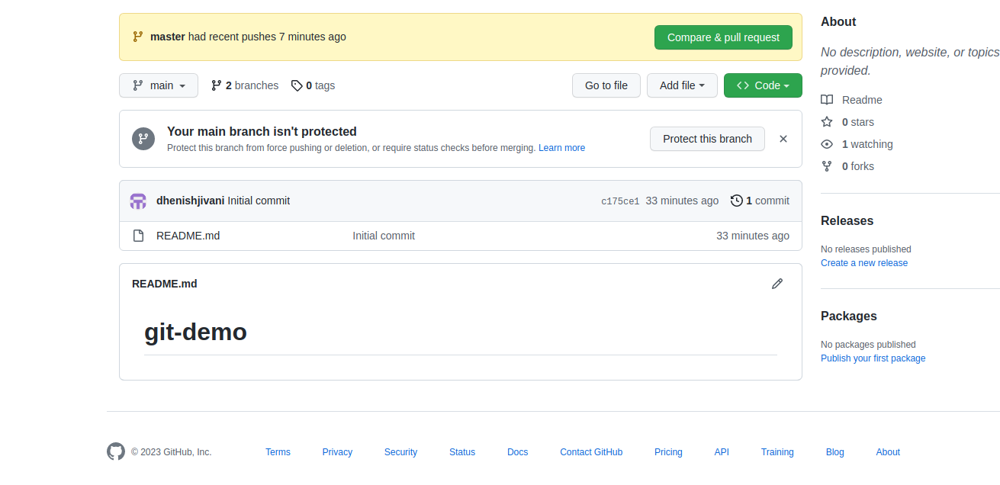
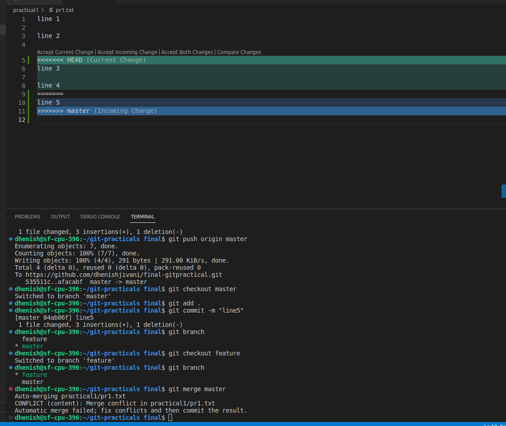
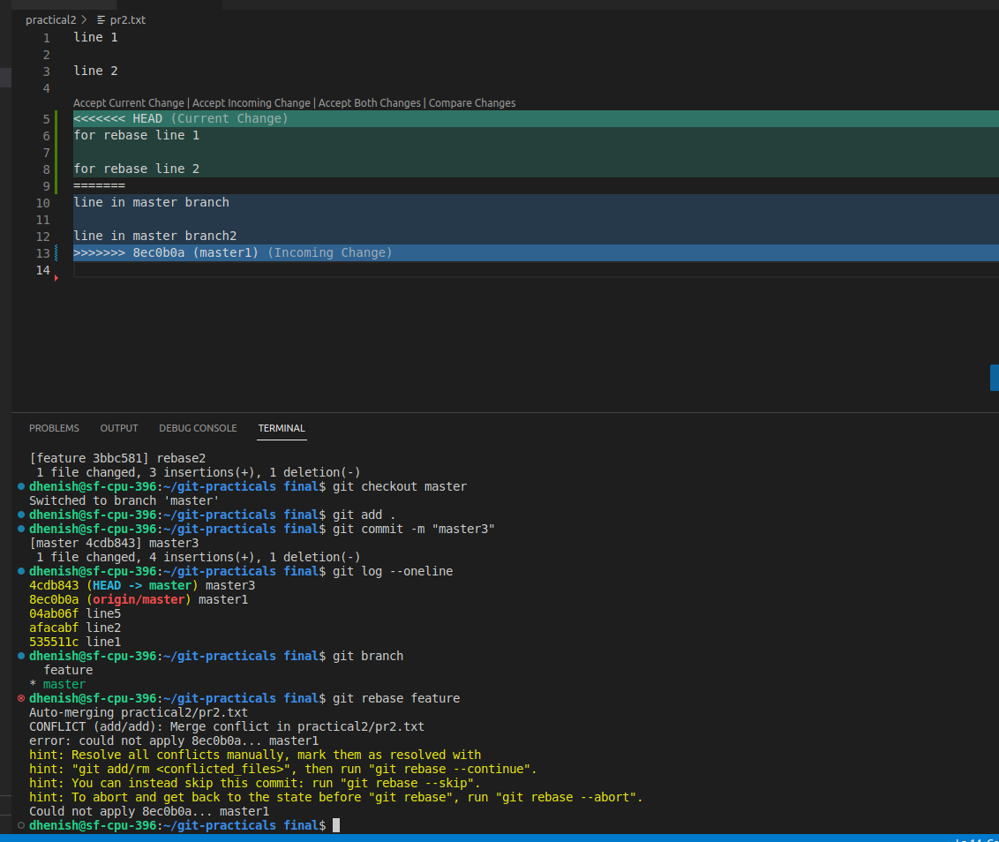
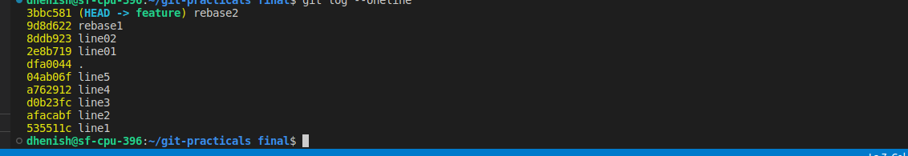
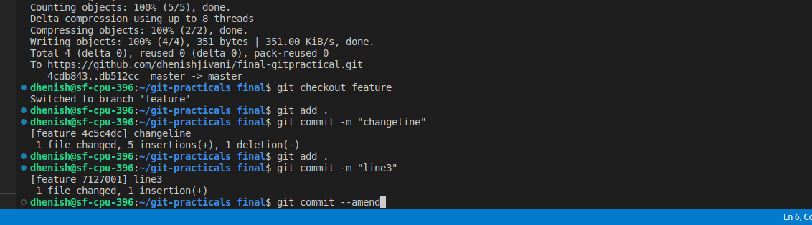
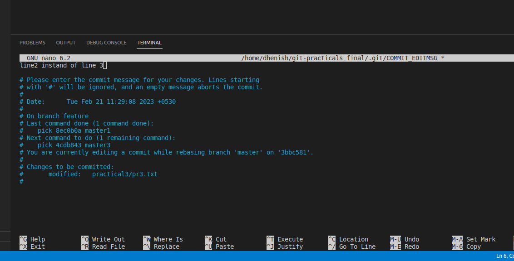
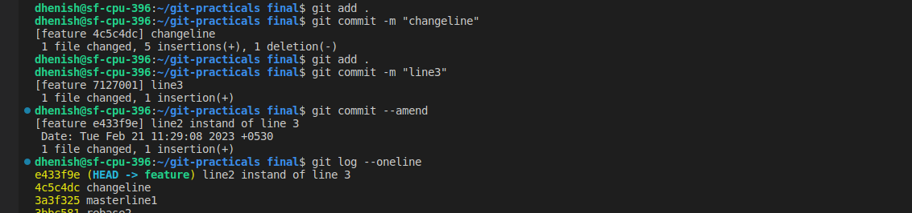
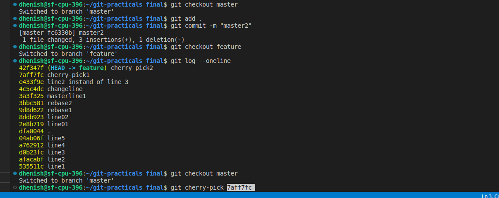
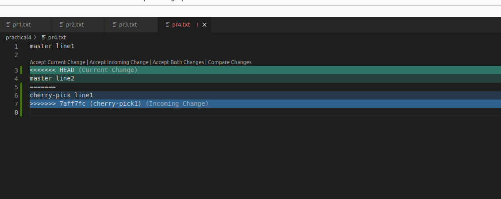
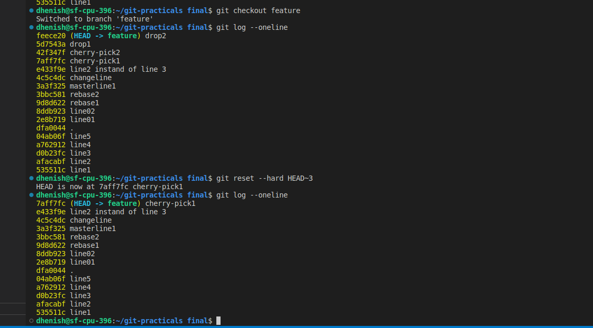

# Git Commands

### 1. Init
The git init command creates a new Git repository on your local machine. 
```
git init
```
### 2. Clone
Git clone command retrieve an entire repository from a hosted location via URL so it is like copy of repository
```
git clone {repository link}
```

### 3. Status
Git status command show the modified, deleted or newly created file of current directory for next stage.
```
git status
```

### 4. Add
Git add command add the untrackable or changed file into staging area.

```
# Perticular one file
git add {file name}

# for all file
git add .

```

### 5. Commit
Git commit is commit your staged content as a new commit. It is used when we change any work in any file then it is needed.

``` 
git commit -m "message"
```

If you want to commit file without ``` git add ``` command then use below command  
**Note:** Here only trackable file will commit if you have create new file then this command is not usefull.
```
git commit -a -m "message"
```

### Link the remote repository & Push
   
```
git remote add origin <link>
git push origin master
```

# Practical 1 : Pull & Merge difference
Git pull command is fetch the history from remote branch and merge it into current branch. 
    
```
git pull origin master
```



Git merge command merge current branch with target branch.

    
```
git merge master
```



# Practical 2 : Rebase
Git rebase command take all commit of target branch and add inside current branch as it is. It is the process of moving or combining a sequence of commits to a new base commit.

```
git rebase {target branch}
```

first doing some commits in master branch


now switch into a feature branch and doing a some commits


after applying rebase :





# Practical 3 : Change commit message

Change the message of the last commit using Commit --amend command

```
git commit --amend
```

before applying amend:



Change the message of the commit using rebase:




# Practical 4 : cherry pick

Cherry-picking in Git stands for applying some commit from one branch into another branch. we can retrieve any commit from any branch and put it on current branch.

```
git cherry-pick <commit-hash>
```




# Practical 5 : Drop commit

Reset command is used to drop any commit. 

Reset --hard is used to permanently delete the commit.


```
git reset --hard HEAD^   
git reset --hard HEAD~2
```

HEAD~2 is drop last two commit from our pointer or HEAD


